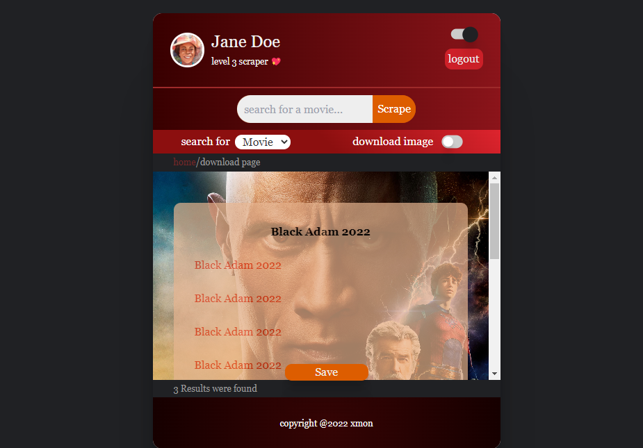

# 30th September 2022

- worked on the first two pages of the front end

#### TODO

- [] #front learn how to make a loading effect/animation
- [] #back how to collect data from browser to backend for django to process
- [] #back scraping algorithm make-over

> This is not a day's job. Relax but be consistent. Slowly but sure, we will get there

_I'm out @6:24pm_

---

# 2nd October 2022

- [x] connect frontend and backend
- [x] collect data from frontend to backend

# 3rd October 2022

It works
UP NEXT ...

- [] work on saving scraped results in `model` (search key, search results: movie title, movie links, movie image)
- [] front end looks
- [] error handling
- [] scraper algorithm is not able to catch some links
- [] scraper algorithm should be faster
- [] over time, you will need to advance your scraping algorithm to other platforms
- [] add advanced features where you can scrape multiple movies at a go. you just have to paste the queries

---

# 7th October, 2022

### Saving scraped results in `model`

- [] Define data Items
- []

